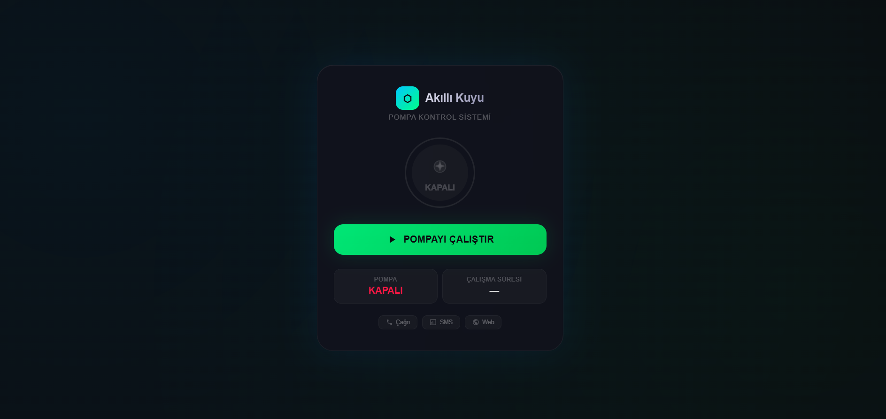

# ESP32 Smart On/Off — Akıllı Pompa Kontrol Sistemi

ESP32 ile telefon çağrısı (DTMF), SMS ve Web üzerinden kontrol edilebilen akıllı pompa/cihaz açma-kapama sistemi.

## Özellikler

| Özellik | Açıklama |
|---------|----------|
| **Çağrı ile Kontrol** | Yetkili numaradan arayın, tuş 1 ile açın, tuş 0 ile kapayın |
| **SMS ile Kontrol** | AC / KAPA / DURUM / KILIT / COZ komutları |
| **Web Arayüz** | Siyah neon temalı, interaktif, mobil uyumlu |
| **Yetkilendirme** | Sadece tanımlı numaralar kontrol edebilir |
| **Manuel Kilit** | SMS ile kilitlenebilir, yetkisiz kullanım engellenir |
| **Otomatik Kapatma** | 1 saat sonra güvenlik amaçlı otomatik kapanma |
| **Çoklu Kontrol** | 3 farklı yöntem (Çağrı / SMS / Web) |
| **Neon Tema** | Siyah arkaplan, neon yeşil/kırmızı efektler, canlı animasyonlar |

## Örnek Kullanım: Akıllı Kuyu Sistemi

Bu proje özellikle **kuyu pompaları** için tasarlanmıştır. Tarlanızda, bağınızda veya bahçenizdeki kuyu pompasını uzaktan kontrol etmek için idealdir.

### Neden Kuyu Sistemi İçin Uygun?

- **Telefon çekmeyen yerlerde** SMS ile kontrol
- **Tarladan uzaktayken** web üzerinden açıp kapama
- **Yaşlı/kullanımı zor arayüzler** yerine tek tuşla kontrol
- **Acil durum** manuel kilitleme ile koruma
- **Elektrik kesintisi** durumunda yedek pil ile çalışabilme

### Kuyu Sisteminde Kullanım Senaryosu

1. Sabah sulama zamanı — cep telefonunuzdan kuyu pompasını çalıştırın
2. Sulama bitti — tek tuşla pompayı durdurun
3. ya da SMS atın: `KAPA`
4. Web üzerinden anlık durumu görüntüleyin
5. Yetkisiz kullanıma karşı SMS ile kilitleyin: `KILIT`

## Donanım Gereksinimleri

| Bileşen | Adet | Açıklama |
|---------|------|----------|
| ESP32 Dev Board | 1 | WiFi + Bluetooth |
| SIM800L GSM Modül | 1 | Çağrı ve SMS için |
| 2-Kanallı Röle Modülü (5V) | 1 | Pompa kontrolü |
| LM2596 DC-DC Buck Dönüştürücü | 1 | 12V -> 5V dönüşüm |
| 12V 2A Adaptör | 1 | Sistem gücü |
| Breadboard + Jumper Kablo | 1 set | Prototip |
| Su Geçirmez ABS Kutu (IP65) | 1 | Dış mekan |
| Sigorta (6-10A) + Pako Şalter | 1 | Güvenlik |

**Tahmini Maliyet:** ~900-1500 ₺ (zorunlu bileşenler)

## Bağlantı Şeması

```
ESP32              SIM800L
─────              ───────
GPIO16 (RX2) ◄──── TX
GPIO17 (TX2) ────► RX
3.3V              VCC (3.7-4.2V regülatör ile)
GND               GND

ESP32              RÖLE
─────              ────
GPIO26 ──────────► IN1
GND    ──────────► GND
5V     ──────────► VCC

ESP32              LED
─────              ───
GPIO2  ──────────► + (220Ω ile)
GND    ──────────► -

RÖLE ÇIKIŞLARI:
COM ─── 220V Şebeke Fazı (sigorta üzerinden)
NO  ─── Pompa Faz
```

**⚠ ÖNEMLİ:** SIM800L sadece 3.7V-4.2V ile beslenir. ESP32'nin 3.3V veya 5V çıkışı yetmez. LM2596 ile 5V'a düşürüp besleyin veya ayrı 3.7V LiPo pil kullanın.

## Kurulum

### 1. Arduino IDE Hazırlığı

1. Arduino IDE'yi açın
2. **Dosya > Tercihler > Ek Devre Kartı Yöneticisi URL'leri**'ne ekleyin:
   ```
   https://raw.githubusercontent.com/espressif/arduino-esp32/gh-packages/package_esp32_index.json
   ```
3. **Araçlar > Kart > Kart Yöneticisi** > "ESP32" aratın ve kurun
4. Kart olarak **"ESP32 Dev Module"** seçin

### 2. Kodu Yükleme

1. `esp32-smart-onoff.ino` dosyasını Arduino IDE ile açın
2. **Yetkili numaraları** güncelleyin:
   ```cpp
   const String yetkiliNumaralar[] = {"+90XXXXXXXXXX", "+90XXXXXXXXXX"};
   const int yetkiliSayisi = 2;
   ```
3. WiFi ayarlarını isteğe bağlı değiştirin
4. Bağlantı noktasını (COM port) seçin
5. **Yükle**'ye basın

### 3. Bağlantı

Kod yüklendikten sonra ESP32 bir WiFi ağı oluşturur:
- **SSID:** `KUYU_SISTEMI`
- **Şifre:** `12345678`

Telefonunuzdan bu ağa bağlanıp tarayıcıda `http://192.168.4.1` açın.

## Kullanım Kılavuzu

### Web Arayüzü

`http://192.168.4.1` adresinde siyah neon temalı, interaktif bir arayüz sizi bekliyor.
- Pompa durumu canlı gösterge
- Animasyonlu döner pervane
- Otomatik güncelleme (2 saniyede bir)
- Tek tıkla aç/kapat



### SMS Komutları

Yetkili numaradan aşağıdaki komutları SMS olarak gönderin:

| SMS | Etki |
|-----|------|
| `AC` | Pompayı çalıştırır |
| `KAPA` | Pompayı durdurur |
| `DURUM` | Pompa ve kilit durumunu bildirir |
| `KILIT` | Manuel kilidi aktif eder (kimse açıp kapayamaz) |
| `COZ` | Manuel kilidi kaldırır |

### Çağrı ile Kontrol (DTMF)

1. Yetkili numaradan sistemi arayın
2. Çağrı otomatik cevaplanır
3. Tuş takımından yönlendirin:

| Tuş | İşlem |
|-----|-------|
| **1** | Pompayı çalıştır (onay sesi) |
| **0** | Pompayı durdur (onay sesi) |
| **3** | Görüşmeyi sonlandır |

- Telefonu kapatınca görüşme biter ve durum SMS'i gelir
- 2 dakika işlem yapılmazsa zaman aşımı

## Güvenlik Önlemleri

- [ ] Yetkili numara listesini güncelleyin
- [ ] WiFi şifresini değiştirin (`KUYU_SISTEMI` / `12345678`)
- [ ] Röle ile pompa arasına sigorta ekleyin
- [ ] Su geçirmez kutu kullanın (IP65)
- [ ] Topraklama yaptığınızdan emin olun
- [ ] Manuel kilit özelliğini aktif kullanın

## Test Prosedürü

1. **SIM kart takılı değilken** WiFi üzerinden test edin
2. SMS komutlarını test edin (AC / KAPA / DURUM)
3. Çağrı ile DTMF testi yapın (1 / 0 / 3)
4. Pompa bağlamadan önce röle tıklamasını kontrol edin
5. Kilit özelliğini test edin (KILIT / COZ)
6. Son olarak pompayı bağlayın

## Sorun Giderme

| Sorun | Çözüm |
|-------|-------|
| Sistem açılmıyor | Güç bağlantılarını kontrol edin |
| GSM çalışmıyor | SIM800L beslemesini ölçün (3.7-4.2V) |
| SMS gitmiyor | Anteni kontrol edin, `AT+CSQ` ile sinyal testi |
| WiFi görünmüyor | ESP32'yi resetleyin |
| Röle tıklamıyor | GPIO26 bağlantısını kontrol edin |
| Çağrı cevaplanmıyor | SIM kartın arama izni var mı kontrol edin |

## Proje Yapısı

```
esp32-smart-onoff/
├── esp32-smart-onoff.ino     # Ana kod (ESP32 + SIM800L)
├── README.md                  # Bu dosya
├── bom.md                     # Malzeme listesi
├── schematic.txt              # Devre şeması
└── docs/
    └── screenshot.png         # Web arayüz ekran görüntüsü
```

## Lisans

MIT License — özgürce kullanın, değiştirin, paylaşın.
